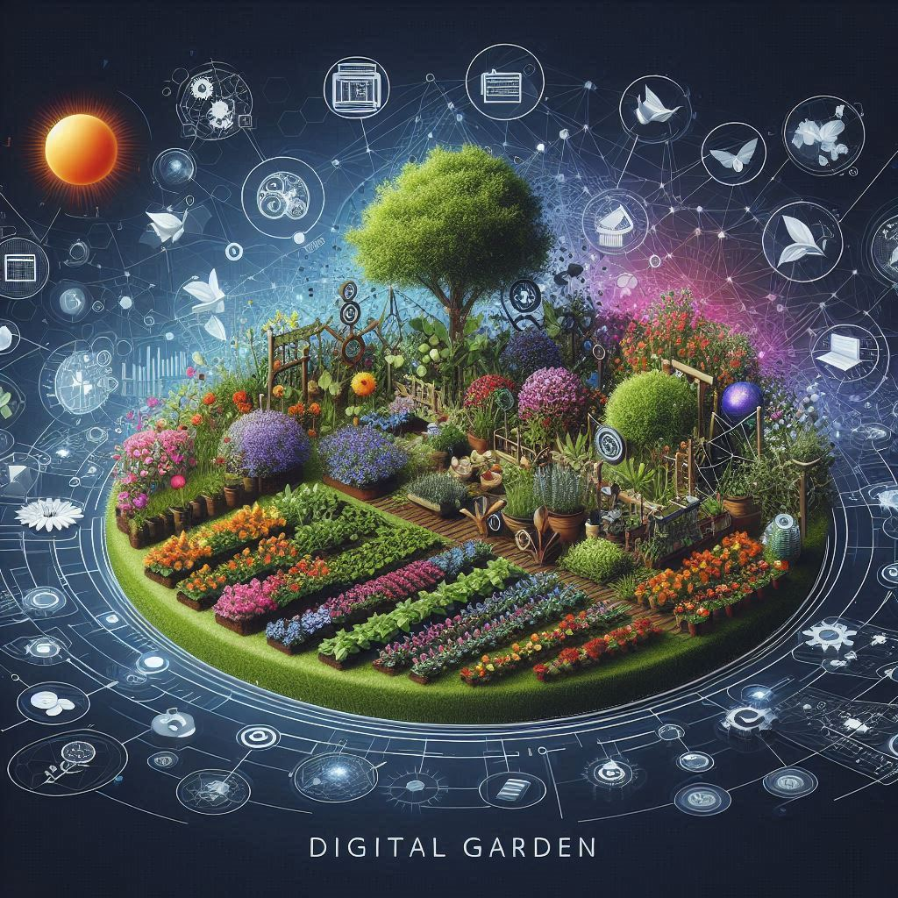
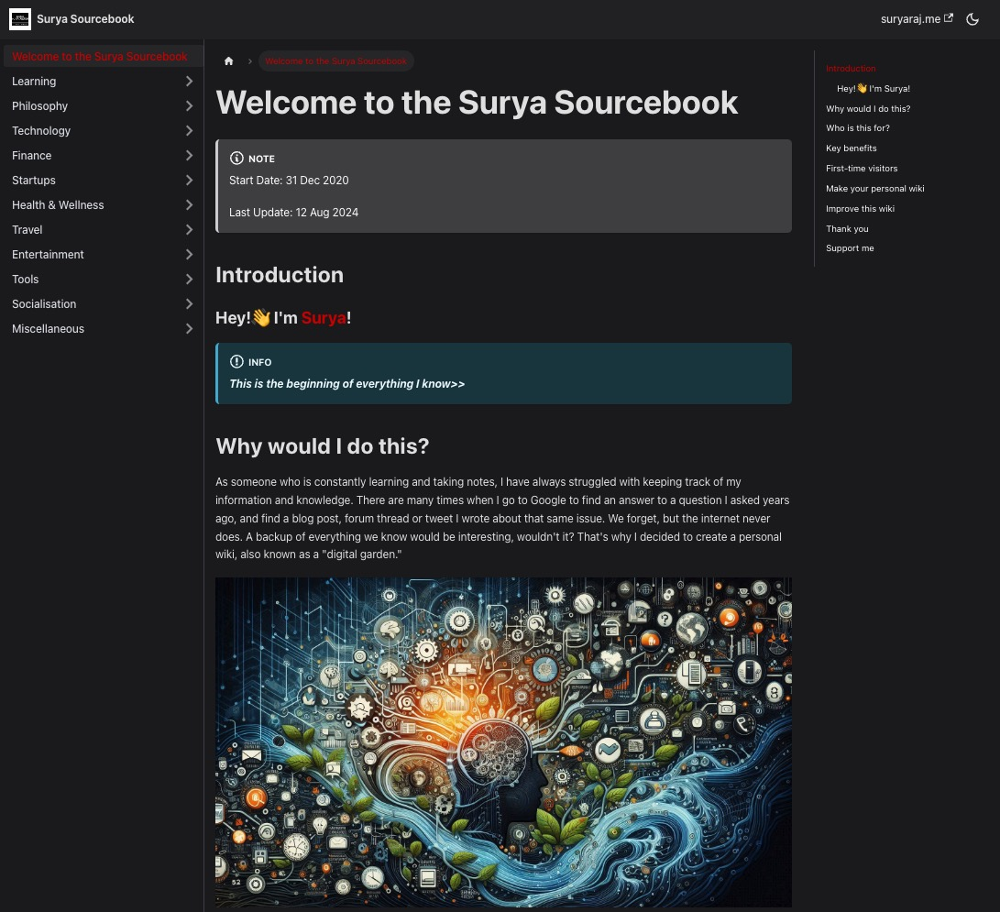

## Introduction

In an era where information is abundant and often overwhelming, digital gardens have emerged as a unique and personal way to cultivate knowledge, ideas, and creativity. Unlike traditional blogs that present polished, final versions of thoughts, digital gardens are living documents that grow, change, and evolve over time. If you're curious to see a digital garden in action, feel free to explore my own garden [here](https://wiki.suryaraj.me/).

## The Concept of Digital Gardens

### What is a Digital Garden?

A digital garden is a personal space on the internet where ideas, notes, and knowledge are cultivated over time. Unlike a blog, which is typically organized chronologically, a digital garden is more like a wiki or a mind map, where content is interconnected and constantly updated. It's a place where thoughts can be "planted" as seeds, nurtured as they grow, and eventually pruned or expanded as they mature.

The term "digital garden" emphasizes the organic, non-linear nature of this form of knowledge management. It's not about publishing polished, final pieces but about sharing a work in progress, much like tending to a real garden where plants are constantly growing and changing.

### The Origins of Digital Gardens

The concept of digital gardens evolved from the need to create a more personal and reflective space online, where ideas could grow and change over time. As early as the 2000s, people on platforms like Reddit and Twitter began discussing the limitations of traditional blogs and the desire for something more dynamic.

For example, in Reddit threads such as ["What's your approach to digital gardening?"](https://www.reddit.com/r/roamresearch/comments/hvbbvj/whats_your_approach_to_digital_gardening/), users shared their thoughts on creating non-linear, growth-oriented knowledge spaces. These discussions laid the groundwork for what would eventually become known as digital gardens.

Twitter also played a crucial role in the popularization of digital gardens. Thought leaders and early adopters used the platform to share their experiments with personal knowledge management. Twitter threads like ["Exploring the concept of Digital Gardens"](https://twitter.com/search?q=digital%20garden&src=typed_query&f=live) sparked widespread interest, encouraging others to explore this new way of organizing and sharing ideas.

As the idea gained traction, individuals began experimenting with tools like [TiddlyWiki](https://tiddlywiki.com/), [Roam Research](https://roamresearch.com/), and [Obsidian](https://obsidian.md/), which allowed them to create interconnected, non-linear knowledge bases. These tools, coupled with the growing community interest, solidified the digital garden as a distinct and valuable concept in the realm of personal knowledge management.

### The Concept of "Personal Wiki" and Its Relationship to Digital Gardens

Another key influence on digital gardens is the concept of a "personal wiki." A personal wiki is a private or public knowledge base that is continuously updated and interconnected. This concept has been around for years, with tools like [TiddlyWiki](https://tiddlywiki.com/) allowing users to create flexible, non-linear collections of information.

Digital gardens and personal wikis share many similarities. Both emphasize continuous growth, non-linearity, and the ability to update content over time. While personal wikis traditionally focused on creating a comprehensive knowledge base, digital gardens extend this concept by incorporating a more organic, garden-like approach to knowledge cultivation.

In many ways, digital gardens can be seen as an evolution of the personal wiki. The key difference lies in the presentation and philosophy behind them. Digital gardens tend to be more public-facing, with an emphasis on sharing works-in-progress and fostering a sense of community, while personal wikis are often more private and structured.

## Examples of Digital Gardens

### Curated Lists of Digital Gardens and Personal Wikis

The digital gardening community is vast and diverse, with many people sharing their personal knowledge management systems online. Here are some curated lists where you can explore various digital gardens and personal wikis:

- **[Awesome Digital Gardens](https://github.com/MaggieAppleton/digital-gardeners)**: This GitHub repository by Maggie Appleton features a comprehensive list of digital gardens and the individuals who maintain them. It's a great starting point for exploring the variety of approaches people take in their gardens.
- **[Personal Wikis](https://wiki.c2.com/?PersonalWiki)**: This wiki page lists various personal wikis, providing a glimpse into how different people organize and curate their knowledge.
- **[TiddlyWiki Users List](https://tiddlywiki.com/#Community)**: A community-driven list of TiddlyWiki users, showcasing how this tool has been used for personal knowledge management over the years.

These resources provide a wealth of inspiration for anyone interested in starting their own digital garden or exploring how others approach personal knowledge management.

## The Buzz Around Digital Gardens

Digital gardens have generated significant buzz in recent years, particularly as more people seek alternatives to traditional blogging and social media. The concept has been widely discussed in online communities, with many people sharing their gardens and connecting with others.

One notable moment in the digital garden movement was the launch of [Roam Research](https://roamresearch.com/) in 2019, a tool that has been widely adopted by those interested in networked thought and personal knowledge management. Roam's ability to create bi-directional links between notes has made it a popular choice for digital gardeners, and its community has grown rapidly, with many users sharing their gardens online.

Another key moment was the rise of [Obsidian](https://obsidian.md/) in 2020, a tool that allows users to create a "second brain" by linking notes together. Obsidian's flexibility and local-first approach have made it a favorite among digital gardeners who want more control over their data.

  

## Conclusion

Digital gardens represent a shift away from the fast-paced, performative nature of traditional blogging and social media. They offer a more organic, reflective way to share knowledge and ideas, where content is allowed to grow and evolve over time. As someone who has embraced this concept, I invite you to explore my own digital garden [here](https://wiki.suryaraj.me/), where you can see how I've curated my thoughts and ideas.

In creating and tending to my digital garden, I've found that it provides a sense of freedom and creativity that is often missing in other forms of online expression. It's a space where I can experiment, learn, and grow, all while sharing my journey with others. Whether you're new to the concept or a seasoned digital gardener, I hope this exploration has inspired you to start or continue cultivating your own garden.

  

