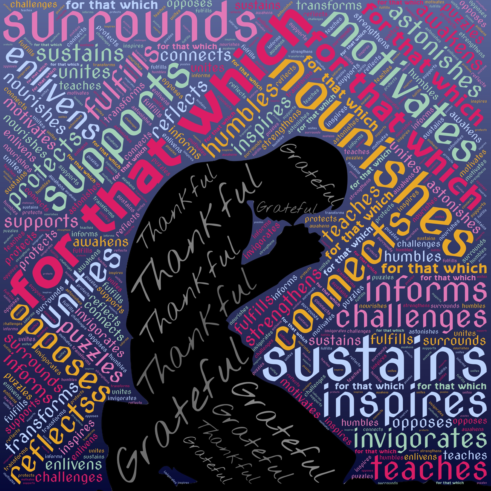

In a world that celebrates knowledge, a timeless whisper endures: "Enlightenment arises from acknowledging our limited perception." Often attributed to the sage Socrates, these words invite us to embark on a journey delving into the relationship between humility and profound understanding. Amid the cacophony of certainties, it's easy to overlook the treasures hidden within the realm of the unknown. Join us as we navigate this uncharted terrain, unearthing the essence of humility intertwined with our quest for comprehension.

## Unveiling the Essence: Guiding Lights in the Darkness

At its heart, humility isn't self-doubt; it's the beacon illuminating genuine wisdom—an acknowledgment that our grasp is a droplet in the sea of collective knowledge. Empowering us to learn from the world, humility fosters empathy, allowing us to embrace diverse viewpoints and gain a deeper appreciation for our interconnected reality.

## The Path to Deeper Insight: Nurturing the Seed of Humility

Why does humility resonate so profoundly with understanding? It's the key to unlocking revelations. By humbly admitting our limits, we open doors to exploration and growth. In this embrace, we lay the foundation for forging connections, fostering relationships, and gaining a profound awareness of life's intricate fabric.

## Cultivating Humility: Navigating the Terrain of Knowledge

To infuse humility into our lives, we must chart a deliberate course of action:

* __Curiosity Unleashed:__ Cultivate an insatiable curiosity that drives you to explore the uncharted territories of knowledge. Seek out diverse perspectives, challenge assumptions, and revel in the joy of discovery.
* __Gratitude as a Guiding Compass:__ Embrace gratitude as a compass, directing your attention to the myriad influences that have shaped your journey. Acknowledging the contributions of others reinforces the humility of our place in the grand symphony of life.
* __Embrace Unfamiliar Waters:__ Dare to venture beyond your comfort zone, where uncharted waters flow. By confronting the unknown, we embrace humility's essence, and we recognize the beauty of embracing uncertainty.

## The Dance with Wisdom: Embracing the Unseen

In a world drawn to certainties, humility emerges as a beacon guiding us to deeper understanding. As we surrender claims of all answers, we unearth enlightenment. Embracing the unknown leads to growth, connections, and an enriched grasp of life's intricate tapestry. Wisdom flourishes in humble recognition of boundless mysteries.

